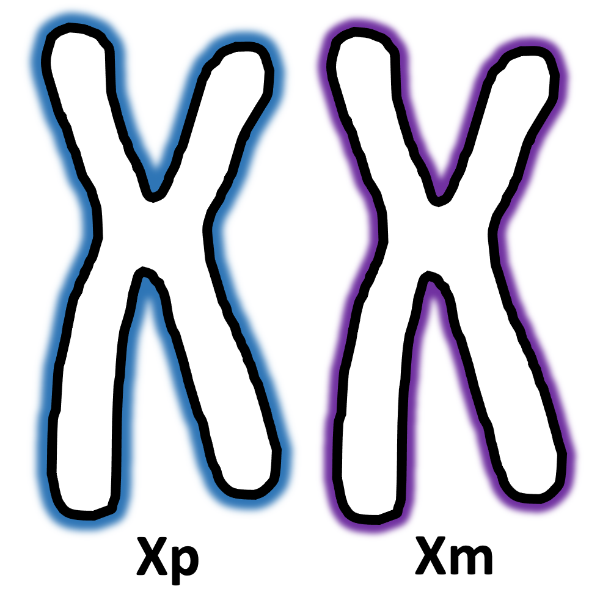

---
output:
  html_document: default
---
<style type="text/css">
  body{
  font-size: 12pt;
}
</style>

```{r setup, include=FALSE}
knitr::opts_chunk$set(echo = TRUE)
```

<br />

**TITLE**

words

{width=20%}\
